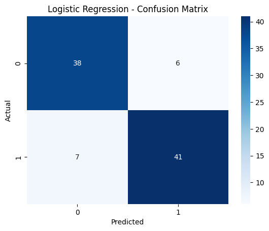
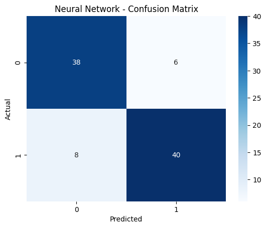

# 🫀 Heart Disease Classifier

A machine learning project to predict the presence of heart disease using clinical patient data. This project explores and compares three powerful models:

- ✅ Logistic Regression
- ✅ Deep Neural Network (Keras)
- ✅ XGBoost Classifier

We analyze and visualize performance using confusion matrices, accuracy, and other classification metrics.

---

## 📁 Project Structure

```
Heart-Disease-Classifier/
│
├── data/                   # Dataset (heart.csv)
├── models/                 # Saved model files (optional)
├── notebook/               # Full Jupyter/Colab notebook
├── plots/                  # Confusion matrix images for each model
├── requirements.txt
├── .gitignore
└── README.md
```

---

## 🧠 Models Compared

| Model               | Description                            |
|--------------------|----------------------------------------|
| Logistic Regression| Simple, interpretable linear model     |
| Neural Network     | Deep fully-connected network with L2 regularization |
| XGBoost            | Gradient-boosted decision tree model   |

---

## 📊 Evaluation Metrics

Each model is evaluated using:

- ✅ Accuracy
- ✅ Classification Report (Precision, Recall, F1-Score)
- ✅ Confusion Matrix
- ✅ Mean Squared Error (for model loss comparison)

---

## 🧪 Confusion Matrices

### 🔹 Logistic Regression


---

### 🔹 Neural Network


---

### 🔹 XGBoost Classifier


---

## 🧰 Technologies Used

- Python 3
- [Pandas](https://pandas.pydata.org/)
- [NumPy](https://numpy.org/)
- [Matplotlib](https://matplotlib.org/)
- [Seaborn](https://seaborn.pydata.org/)
- [Scikit-learn](https://scikit-learn.org/)
- [TensorFlow/Keras](https://www.tensorflow.org/)
- [XGBoost](https://xgboost.readthedocs.io/)

---

## ⚙️ How to Run

1. Clone this repository:

```bash
git clone https://github.com/yourusername/Heart-Disease-Classifier.git
cd Heart-Disease-Classifier
```

2. Install the required libraries:

```bash
pip install -r requirements.txt
```

3. Run the notebook inside the `notebook/` folder:

```bash
jupyter notebook notebook/Heart_Disease_Prediction.ipynb
```

> Or open it in [Google Colab](https://colab.research.google.com/)

---

## 📌 Results Summary

| Model               | Accuracy (val set) | Train Loss | Val Loss |
|--------------------|--------------------|------------|----------|
| Logistic Regression| ✅ ~88.4%           | 0.XXX      | 0.XXX    |
| Neural Network     | ✅ ~88.4%           | 0.XXX      | 0.XXX    |
| XGBoost            | ✅ ~92.4%           | –          | –        |


---

## 📂 File Descriptions

| File / Folder      | Description |
|--------------------|-------------|
| `heart.csv`        | Original heart disease dataset |
| `notebook/`        | Code notebook with training + visualization |
| `plots/`           | Confusion matrix images |
| `models/`          | Saved model files (e.g. `.h5`, `.json`) |
| `README.md`        | This documentation |
| `requirements.txt` | List of required Python packages |

---

## 💡 Future Improvements

- Add ROC/AUC curve visualization
- Hyperparameter tuning (GridSearchCV / KerasTuner)
- Feature importance from XGBoost
- Export predictions for external validation

---

## 📜 License

This project is licensed under the MIT License.  
Feel free to fork and build upon it.

---

## 🔗 Connect with Me

- 💼 [LinkedIn](https://www.linkedin.com/ahmed-farahat-104077286/)
- 📧 ahmedfrahat524@gmail.com
- 📁 Check my other projects on [GitHub](https://github.com/ahmedfarahat990)

---

**Star this repo if you find it useful ⭐**
